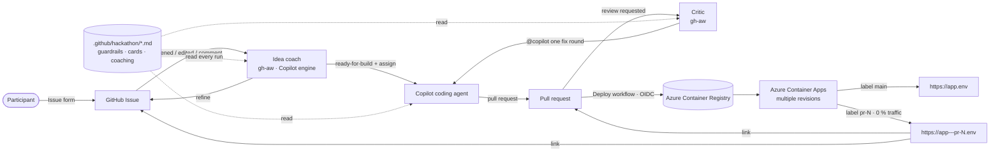
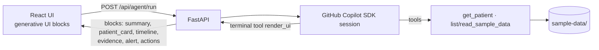

# Health Rewired · Oncology Hackathon 2026 · Munich

> **Want to change what the hackathon agent considers a good idea?**
> **Edit the Markdown guardrails in [`.github/hackathon/`](.github/hackathon/README.md).**
> No YAML, Python or workflow change is needed.

## 1. What this repository is

A hackathon platform with two halves:

| Half | What it is | Where |
|---|---|---|
| **Starter app** | One polished container: FastAPI + GitHub Copilot SDK agent, React/TypeScript UI with generative UI blocks, synthetic oncology data | `backend/`, `frontend/`, `sample-data/` |
| **Agentic development environment** | Issue form → AI idea coach → Copilot coding agent → post-build critic → per-PR live URL on Azure Container Apps | `.github/`, `scripts/` |

The app is a **canvas, not a solution**. Every idea starts from it.

## 2. Participant experience

Participants are clinicians and researchers who do not need to code.

```text
IDEA → CONVERSATION → BETTER IDEA → AGENT BUILDS IT → LIVE APPLICATION
```

1. **Open an issue** with the *Oncology idea* form (plain language).
2. **The idea coach replies** in the issue: what is promising, what is unclear, how to stretch it,
   and a few clinical questions. The participant edits the issue or replies; the coach looks again.
3. When the idea is ready, the coach posts a **🚀 Implementation proposal**, labels the issue
   `ready-for-build` and **assigns the Copilot coding agent**.
4. Copilot opens a pull request. Every push deploys a **preview** and posts the link in the PR
   *and* in the issue (label `preview-ready`).
5. The **critic** checks whether the build preserved the interesting idea and can ask Copilot for
   one fix round.
6. The participant tries the live URL and asks for changes by commenting `@copilot …` on the PR.

Labels: `idea` → `needs-refinement` / `out-of-scope` → `ready-for-build` → `preview-ready`;
PR labels `critic-fix-requested`, `critic-done`. Issues are never auto-closed.

## 3. Architecture



App container:



## 4. Local development

Prerequisites: Python 3.11+ with [uv](https://docs.astral.sh/uv/), Node 22+, optionally Docker.

```bash
git clone https://github.com/jochenvw/health-rewired && cd health-rewired
npm run setup   # uv sync (backend) + npm install (frontend workspace)
npm run dev     # API on :8000 and UI on :5173 (proxying /api) together
```

| Command | Does |
|---|---|
| `npm run lint` | ruff check + format check, TypeScript type check |
| `npm test` | backend pytest (offline; uses the deterministic fallback) |
| `npm run build` | production frontend build |
| `npm run docker:build && npm run docker:run` | the exact production container on :8000 (uses `.env`) |

Copy `.env.example` to `.env` for overrides. Health check: `GET /api/health`; runtime info:
`GET /api/status`.

## 5. GitHub Copilot SDK

The agent lives in [`backend/app/agent/`](backend/app/agent) and uses the
[`github-copilot-sdk`](https://github.com/github/copilot-sdk) Python package:

- `runner.py` – one `CopilotClient` per process, one session per request, tool-call trace.
- `tools.py` – data tools over `/sample-data` plus the terminal `render_ui` tool.
- `ui.py` – the generative-UI block schema shared with `frontend/src/blocks/`.
- `fallback.py` – deterministic demo with the same block contract when the SDK is unavailable.

**Authentication** (two separate concerns):

| Context | Credential |
|---|---|
| Local dev | Nothing to configure if you are signed in to the Copilot CLI or `gh`; `COPILOT_USE_LOGGED_IN_USER=true` (default). |
| Deployed container | `COPILOT_GITHUB_TOKEN` = fine-grained PAT with the **Copilot Requests** permission, stored as Container Apps secret `copilot-github-token` (never in the image). Requests bill to that user's Copilot plan. |

Without a token the app still works and shows *Deterministic demo* instead of *Live Copilot SDK
agent*; `/api/status` reports `copilot.auth_mode`.

## 6. Agentic workflow

| Workflow | Trigger | Does |
|---|---|---|
| [`idea-coach.md`](.github/workflows/idea-coach.md) (gh-aw) | Issue opened/edited/reopened, issue comment | Reads all `.github/hackathon/*.md`, coaches, labels, posts the proposal, assigns Copilot |
| Copilot coding agent | Assigned by the coach | Builds the proposal, following [`.github/copilot-instructions.md`](.github/copilot-instructions.md), and writes `capabilities/issue-<N>.md` |
| [`idea-critic.md`](.github/workflows/idea-critic.md) (gh-aw) | Copilot requests review on its PR | Checks the idea was preserved; at most one `@copilot` fix round |
| [`copilot-guardrail-handoff.yml`](.github/workflows/copilot-guardrail-handoff.yml) | Copilot WIP PR with a guardrail marker | If Copilot was assigned an unready idea directly: labels + feedback on the issue, closes the WIP PR |
| [`deploy.yml`](.github/workflows/deploy.yml) | Push to `main`, PRs | CI → image → Container Apps revision → label → link in PR and issue |
| [`preview-cleanup.yml`](.github/workflows/preview-cleanup.yml) | PR closed, daily | Removes PR label, deactivates revisions, deletes image tags |
| [`copilot-setup-steps.yml`](.github/workflows/copilot-setup-steps.yml) | Used by the coding agent | Installs uv/npm deps and the Copilot SDK runtime |

gh-aw workflows are Markdown; after editing a `.github/workflows/*.md` **frontmatter**, run
`gh aw compile` and commit the `.lock.yml`. The instruction bodies and the policy files are read at
run time.

## 7. Guardrails

The gate is in [`.github/hackathon/guardrails.md`](.github/hackathon/guardrails.md), applied in
order: explicit override (`#build_anyway`), oncology scope, progressive AI ambition, preserved
clinical insight, responsibility (synthetic data, human decision boundary). Supporting files:
[`progressive-ai.md`](.github/hackathon/progressive-ai.md),
[`clinical-thinking.md`](.github/hackathon/clinical-thinking.md),
[`capability-cards.md`](.github/hackathon/capability-cards.md),
[`coaching.md`](.github/hackathon/coaching.md),
[`implementation-guidelines.md`](.github/hackathon/implementation-guidelines.md),
[`critic.md`](.github/hackathon/critic.md).

These are coaching and quality controls in a trusted environment, not security controls.

## 8. Azure deployment

One Azure Container App (`healthrewired-munich`) in **multiple-revision mode**:

- Image in Azure Container Registry, pulled with the app's **system-assigned identity** (AcrPull; ACR admin user disabled).
- GitHub Actions log in with **OIDC** (no stored Azure secret): federated credentials for `main` and `pull_request`, roles Contributor on the resource group and AcrPush on the registry.
- Traffic is always pinned to explicit revisions. `main` gets label `main` and 100 % weight, min 1 replica.
- `max-inactive-revisions` 20; PR revisions scale to zero.

## 9. Preview environments

Each PR build creates an immutable revision `…--pr<N>-<sha7>-<attempt>` with label **`pr-<N>`** and
0 % weight, so it never receives production traffic but has a stable URL:

```text
https://<app>---pr-<N>.<environment-domain>
```

`PREVIEW_LABEL` and `APP_VERSION` are set per revision; the UI shows a *Preview pr-N* badge.
New pushes move the label and deactivate the superseded revision. Closing the PR removes the
label, deactivates its revisions and deletes its image tags; a daily sweep catches leftovers.
Forks and Dependabot PRs get CI only.

## 10. Sample data

[`sample-data/`](sample-data/README.md) holds **synthetic** oncology data only: patient JSON
records (breast, lung with EGFR, colon with rising CEA), a trials CSV and an MDT note. The agent
reads it through tools. Add files there and they become available via `list_sample_data` /
`read_sample_data`. Never add real patient data.

Each implemented idea also writes a capability manifest in [`capabilities/`](capabilities/README.md)
so a future *integration agent* can reason about how ideas compose, overlap or conflict – a
semantic synthesis rather than `git merge`.

## 11. Organizer setup

One time, from a machine signed in to `az` and `gh` (Git Bash, WSL, macOS or Linux):

```bash
az login
scripts/bootstrap-azure.sh    # RG, ACR, Container Apps env + app, identity, OIDC app registration
scripts/bootstrap-github.sh   # labels, Actions variables, secrets (prompts)
```

Both are idempotent and reuse existing resources; override names with env vars (see script
headers). Secrets:

| Secret | Used by | How to create |
|---|---|---|
| `COPILOT_GITHUB_TOKEN` | idea coach, critic (gh-aw Copilot engine) | Fine-grained PAT, *Copilot Requests* permission ([gh-aw auth](https://github.github.com/gh-aw/reference/auth/)) |
| `GH_AW_AGENT_TOKEN` | coach assigns Copilot; critic's `@copilot` comment | Fine-grained PAT: actions, contents, issues, pull requests read/write on this repo |
| Container Apps secret `copilot-github-token` | the deployed app agent | `COPILOT_GITHUB_TOKEN=… scripts/bootstrap-azure.sh` |

Manual steps (no stable API):

1. **Copilot coding agent enabled** for the repository (Settings → Copilot → Coding agent).
2. **Allow Copilot PR workflows to run without approval** (Settings → Copilot → Coding agent), otherwise approve each Copilot PR's workflow runs so previews deploy.
3. **Participants need write access** for Copilot to act on their `@copilot` PR comments; add them as collaborators or have an organizer relay requests.

## 12. How to modify hackathon behavior

| I want to… | Edit |
|---|---|
| Change what counts as a good idea | [`.github/hackathon/guardrails.md`](.github/hackathon/guardrails.md) or add a new `*.md` there |
| Push ideas further | [`progressive-ai.md`](.github/hackathon/progressive-ai.md), [`capability-cards.md`](.github/hackathon/capability-cards.md) |
| Change the coach's tone or proposal format | [`coaching.md`](.github/hackathon/coaching.md) |
| Change how Copilot builds | [`implementation-guidelines.md`](.github/hackathon/implementation-guidelines.md), [`.github/copilot-instructions.md`](.github/copilot-instructions.md) |
| Change what the critic checks | [`critic.md`](.github/hackathon/critic.md) |
| Change the issue form | [`.github/ISSUE_TEMPLATE/oncology-idea.yml`](.github/ISSUE_TEMPLATE/oncology-idea.yml) |

Policy changes take effect on the next agent run after they are merged to `main`.
