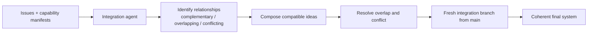

# Capability manifests

Every implemented idea adds one file here: `capabilities/issue-<N>.md`, copied from
[`_template.md`](_template.md). Per-idea files never conflict when branches are combined.

## Why

At the end of the hackathon there will be many ideas on many branches. Some complement each other,
some overlap, some conflict. Combining them with `git merge` would produce an incoherent app.
Instead, an **integration agent** will read these manifests and reason about them semantically:

The integration agent is **not built yet**. The contract it will rely on is the manifest format:
front matter for machines, prose for humans. Keep both accurate.
